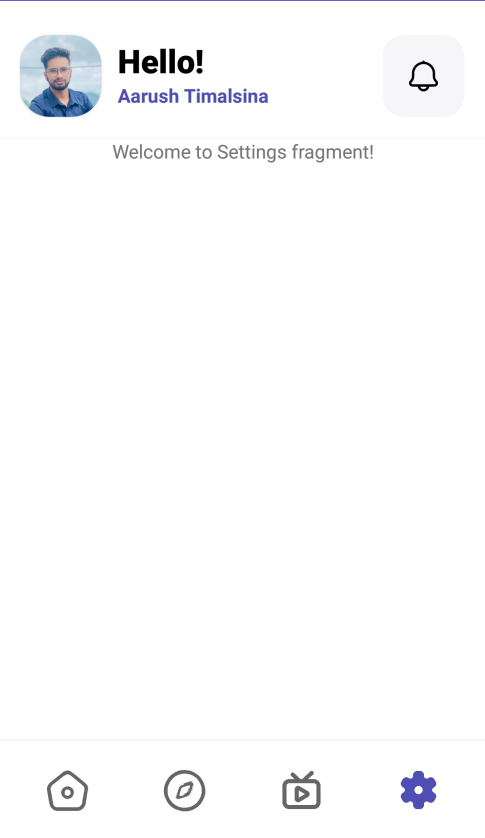

# Hey! This is Live Streaming App Repo! 👋 


## <summary>About Live Streaming App</summary>
   

- This is app is just a practise to implement a complex UI design from Dribbble. It doesn't let you stream game so don't get your hopes up! 


<p align="center">
     
</p>  

- [Click this link for original Dribbble design](https://dribbble.com/shots/21395943-Live-streaming-Gaming-App)

---


- Special features of this app is Home screen, Notification screen and Stream screen.


- Note that there is a bug due to intensive HD images caching. The workaround of optimization and image compression is yet to be done to solve it. Description of bug is that, there is OutOfMemoryError due to which error of not loading images is seen. For temporary solution, below two lines are implemented in Manifest file. It prevents the crash of App and makes image loading possible but it has some other drawbacks such as cardCornerRadius of CardView and MaterialCardView doesn't work due to which cornerly rounded images appear square that affects Stream Fragment.

      - Insert these two lines in  Manifest file inside Application Tag. (Result- Round circular images such as insta story will load in Stream Fragment but other photos will loose rounded corners; they will be square.)

   ```
   android:hardwareAccelerated="false"
   android:largeHeap="true"
   ``` 
      - For better UI in Home Fragment, remove above two lines from Manifest file inside Application tag. (Result- Round user pictures won't load in Stream Fragment but other photos will have better suited rounded corners.)


- In Top toolbar, User Profile Photo, gretting, user name and notification button is shown. Firebase cloud messaging is used for notificaiton and the notification blinks with notification count when an notification comes. Inside notification fragment, the lists of notifications is yet to be made.

<p align="center">
     
     
     
     
     
</p> 

---


- Bottom Navigation consists of Home, Explore, Stream and Settings options. Out of four, only two are designed (Home and Screen). Special designs were mage on bottom navigation to animate on selection.

<p align="center">
     
     
     
     
</p>    

---


   - In Home screen, interactive scrollable buttons are presented using ThemedToggleButtonGroup with HorizontalScrollView. The fragment below is replaced with the option selected. Different options are Stream, Multiplayer, Esports, etc. Only Stream section inside Home Navigation is designed which consists of multiple RecyclerViews of Live Tournament and Popular Games. Live Tournament shows lists of Game Name, Game photo in Background, Tournament time and options. Whereas, Popular Games shows games photo, name, rating and Streaming status.

<p align="center">
     
     
     
     
     
     
</p>    

---


   - In Stream screen, it shows horizontally scrollable users status similar to instagram story. The speciality of this section is that it shows Live status with profile picture if the user is streaming, golden-like circular ring if user is online and gray circular ring around user's profile picture if the user is offline. Below the users status, Recently Lives section is there where Game photo, Streamed game name, location of stream and user profile is shown.

   - Note that there is a bug due to intensive HD images fetches. The workaround of optimization and image compression is yet to be done to solve it. Description of bug is that, there is OutOfMemoryError due to which error of not loading images is seen. Temporarily, 
   ```
   android:hardwareAccelerated="false"
   android:largeHeap="true"
   ``` 
   - are used in Manifest to make it work but it causes some drawbacks such as the cardCornerRadius of CardView and MaterialCardView doesn't work due to which cornerly rounded images appear square.

   - The original image supposed to be shown in stream fragment is:

<p align="center">
     
</p>

- But due to bug, it appears as:

  
<p align="center">
     
     
     
     
</p>    

---